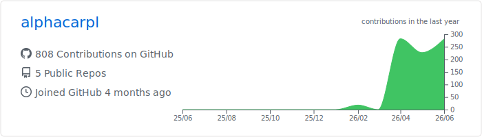
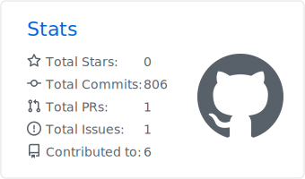
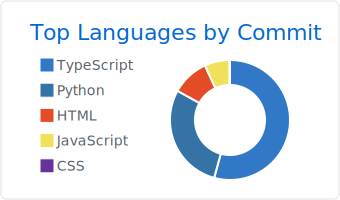
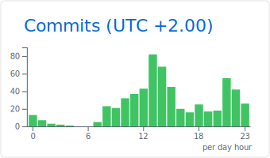

# Cześć, jestem alphacarpl! 👋

Witaj na moim profilu GitHub. Poniżej znajdziesz automatycznie generowane statystyki mojej aktywności, projektów oraz kodu.

## 📈 Moje Statystyki Repozytoriów

<!-- Sekcja z łączną liczbą commitów we wszystkich repozytoriach -->

  
  

## 📊 Aktywność i Pory Pracy

<table>
  <tr>
    <td></td>
    <td></td>
  </tr>
  <tr>
    <td></td>
    <td></td>
  </tr>
</table>

## ⏱️ Czas spędzony na kodowaniu (WakaTime)

<!-- Sekcja na czas pracy. Kiedy skonfigurujesz WakaTime, te grafiki ożyją i zaczną pokazywać godziny -->

  

---
*Statystyki są automatycznie aktualizowane.*
